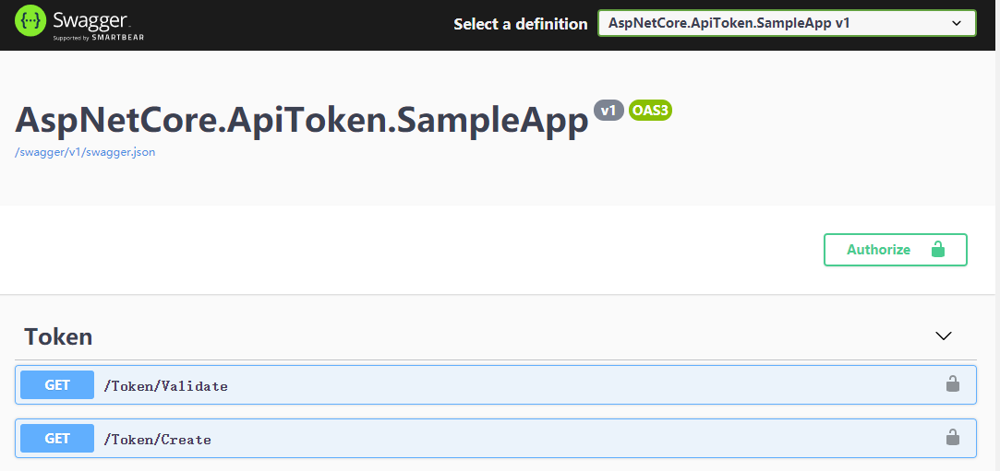

# Run steps

1.Set **MySql** database connection string

appsettings.Development.json

````json
"ConnectionStrings": {
  "DefaultConnection": "<connectionstring>"
}
````

Tips: If your database is not MySQL，you can do this by following these steps：

(1) Delete `Migrations` folder

(2) Remove nuget package `Pomelo.EntityFrameworkCore.MySql`

(3) Install new EF database driver package from nuget

(4) Update registration EF Code in `Startup.cs`

(5) Add Migrations


````shell
Add-Migration init
````

Termnial:

````shell
dotnet ef migrations add init
````

2.Execute EntityFramewok Code Migrations

Package Manager Console:

````shell
Update-Database
````

Termnial:

````shell
dotnet ef database update
````

3.Run



Gif:

